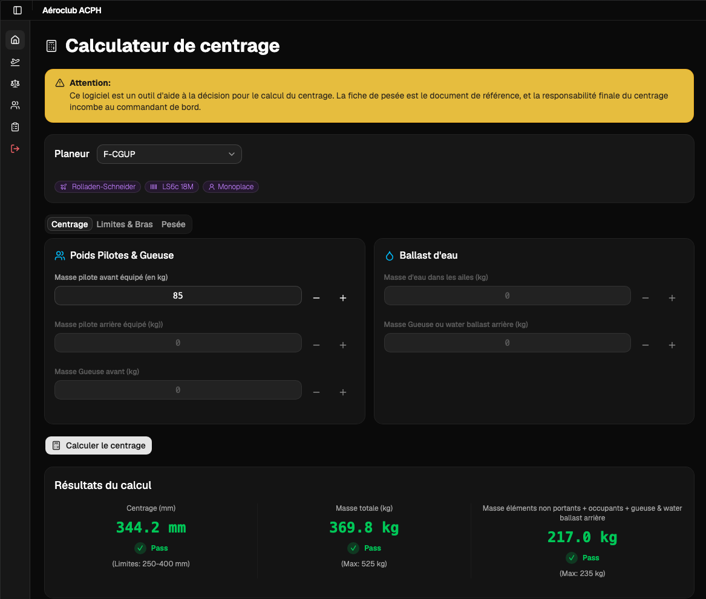
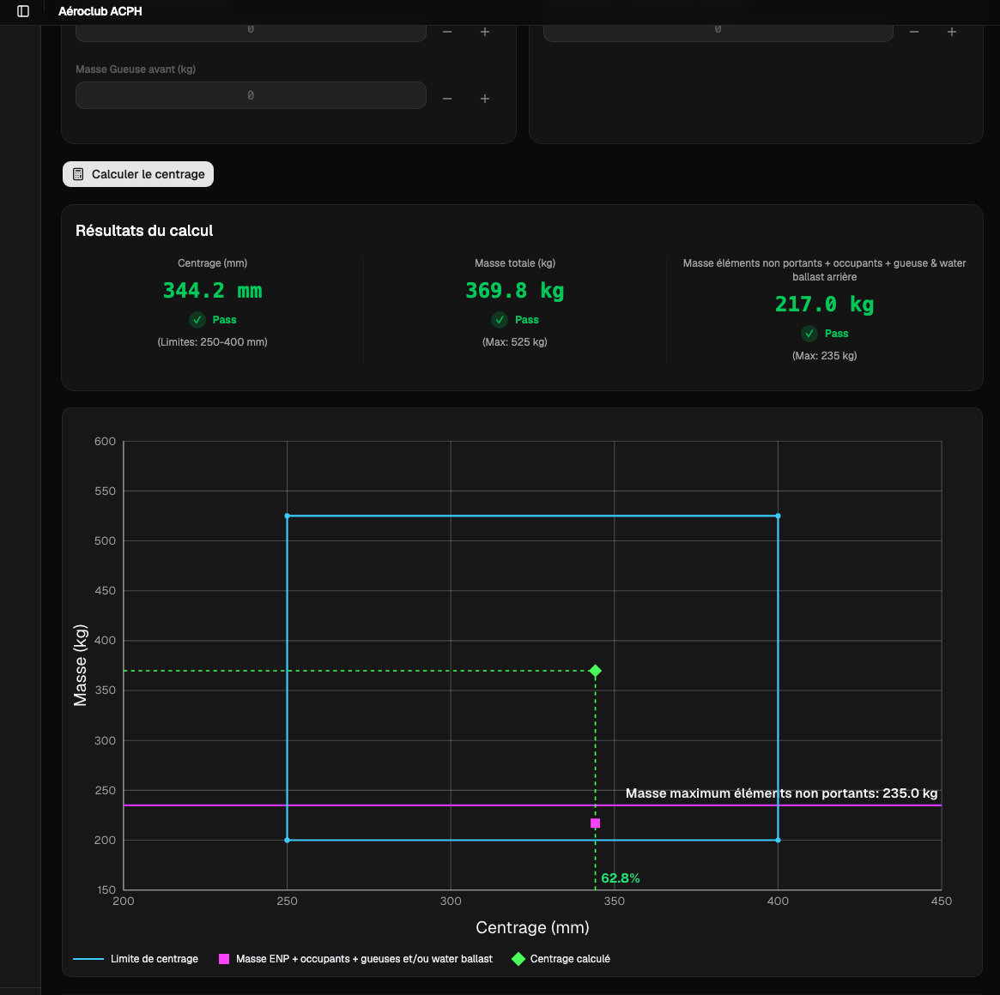

# Center of Gravity Calculator for Gliders

A web application to calculate center of gravity and manage weighings for [ACPH](https://aeroclub-issoire.fr/) gliders.

- **Frontend:** React + Vite + Tailwind UI + Shadcn
- **Backend:** FastAPI service for business logic, auth, and database access

<table>
  <tr>
    <td></td>
    <td></td>
  </tr>
</table>

The frontend lives under `web/`, while the FastAPI backend lives under `backend/`. You can run the app locally with separate frontend/backend processes, or build the frontend and serve it from FastAPI in a single container.

## Repository layout

- `web/`: React frontend application
- `backend/`: FastAPI backend service
- `tests/`: pytest suite
- `e2e/`: Playwright end-to-end tests

## Requirements

- Python 3.12
- Node.js v24

## Local development setup

```bash
git clone https://github.com/tfraudet/PyGliderCG.git
cd PyGliderCG
python3 -m venv .venv
source .venv/bin/activate
```

On Windows:

```bash
.venv\Scripts\activate
```

### Install dependencies

```bash
pip install -r requirements.txt
npm install
npm install --prefix web
```

### Configure environment

```bash
cp .env.example .env
```

Update `.env` with the values needed for your local environment.

Key variables:
- `BACKEND_URL`: backend API URL (default `http://localhost:8000`)
- `VITE_BACKEND_URL`: optional frontend API base URL override
- `JWT_SECRET_KEY`: JWT signing key for backend auth
- `DB_NAME`: DuckDB database file path

## Run the app

### Option 1 — Local development (recommended)

Run the backend and frontend in separate terminals.

Terminal 1 — backend:

```bash
python -m uvicorn backend.main:app --reload
```

Terminal 2 — frontend:

```bash
npm run web:dev
```

Access:
- Frontend: `http://localhost:5173`
- Backend API: `http://localhost:8000`
- Swagger UI: `http://localhost:8000/docs`

### Option 2 — Unified local run

Build the frontend and serve it from FastAPI.

```bash
npm run web:build
./start.sh
```

Access:
- App + API: `http://localhost:8000`
- Swagger UI: `http://localhost:8000/docs`

### Option 3 — Docker

```bash
docker compose up --build
```

Access:
- App + API: `http://localhost:8000`

For a production-style detached run:

```bash
docker compose -f docker-compose.prod.yml up -d --build
```

### Option 4 — API only

Run only the backend service.

```bash
python -m uvicorn backend.main:app --reload
```

Or bind to a specific host/port:

```bash
python -m uvicorn backend.main:app --reload --host 127.0.0.1 --port 8000
```

## Development workflow

For everyday development, use the separate backend/frontend flow.

1. Start the backend with auto-reload:

```bash
python -m uvicorn backend.main:app --reload
```

2. Start the frontend dev server from the repo root:

```bash
npm run web:dev
```

3. Open the frontend at `http://localhost:5173` and the API docs at `http://localhost:8000/docs`.

4. When frontend changes are ready for integration, build and run the app together:

```bash
npm run web:build
./start.sh
```

## Quick API test

```bash
TOKEN=$(curl -s -X POST http://localhost:8000/api/auth/login \
  -H "Content-Type: application/json" \
  -d '{"username":"admin","xxxx":"xxxx"}' | jq -r '.access_token')

curl http://localhost:8000/api/gliders \
  -H "Authorization: Bearer $TOKEN"
```

For detailed endpoint documentation, see [API.md](./API.md).

## Run the tests

Start the backend and frontend first, then run tests in another terminal.

```bash
pytest tests/ -v
```

Run a focused test:

```bash
pytest tests/test_glider.py -v
pytest tests/test_integration.py -v
```

## End-to-end tests

Install Playwright dependencies:

```bash
playwright install
```

Run the suite:

```bash
npx playwright test --config=playwright.config.ts
```

Run a specific browser or spec:

```bash
npx playwright test --config=playwright.config.ts --project=chromium
npx playwright test e2e/glider-mngmt.spec.ts --config=playwright.config.ts --project=webkit
```

Open the last generated HTML report:

```bash
npx playwright show-report
```
